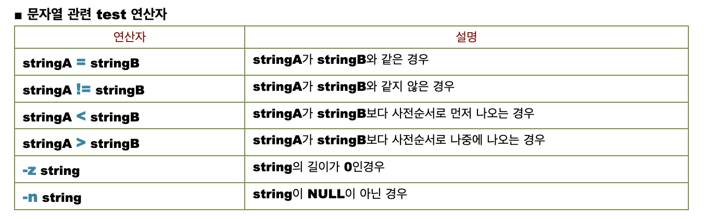
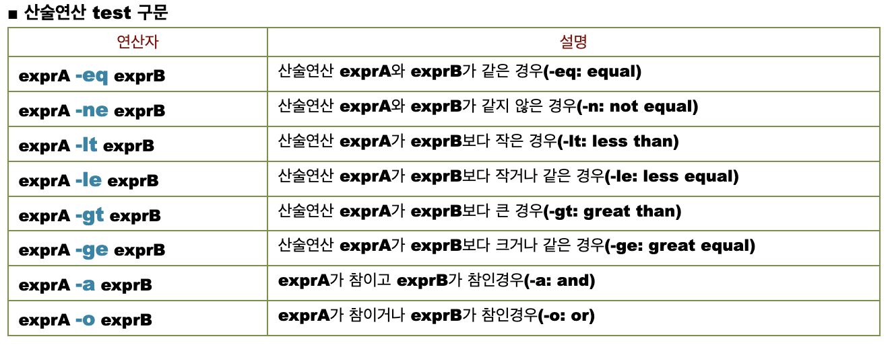
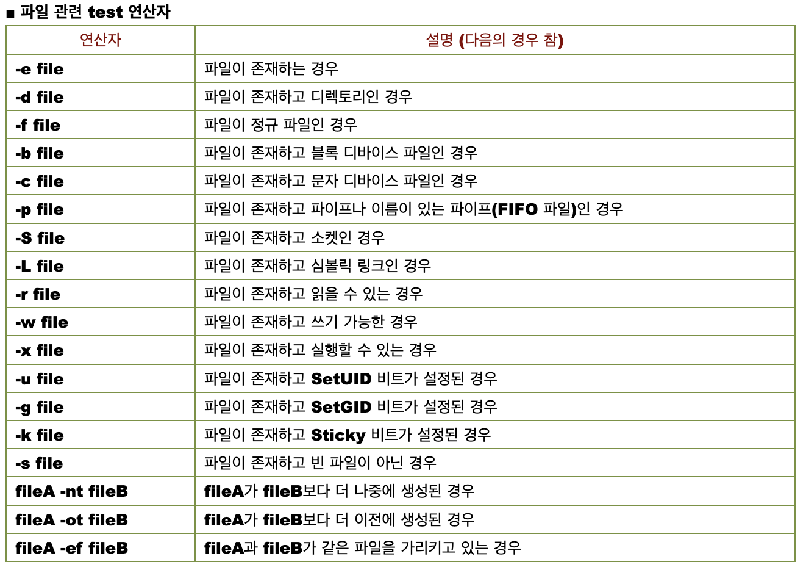

# Test 

- Test는 쉘 스크립트에서 분기 처리를 할 때 많이 사용된다.
- Test는 사실 `[`로 자주 호출되며, 쉘 스크립트를 읽을 때 더 좋은 가독성을 얻기 위함이다.
   
```bash
$ type [
[ is a shell builtin
$ which [
/usr/bin/[
$ ls -l /user/bin/[
$ ls -l /user/bin/test
```
- 즉, `[`는 명령어로 인식되므로 다음과 같이 띄어쓰기를 하지 않는다면 실행되지 않는다.
   
```bash
if [$foo = "bar" ] #ERROR
```

> **쉘 스크립트에서의 비교 연산**
>       
> 다른 언어들 처럼 `==`를 허용하는 Shell 또한 있지만, 대부분 문자열 동등 비교에는 `=` 정수 동등 비교에는 `-eq`를 사용한다.

### Test 사용법

- Test는 다음과 같이 `if`나 `while` 문법에서 자주 사용된다.

```bash
if [ ... ]
then
  # if-code
else
  # else-code
fi
```
# Test의 비교 연산자

- Test는 여러 비교 명령어와 비교 연산을 제공한다.





# Test를 사용할 때 주의할 점

- 유닉스 프로그램에서 `true`,  `false`는 우리가 일반적으로 생각하는 논리 자료형이 아닌 0~255 까지의 오류 상태 코드를 반환하는 프로그램이다. `true`는 `0`을, `false`는 `0`이 아닌 수를 반환한다.

```bash
$  man false
FALSE(1)                                   General Commands Manual                                   FALSE(1)

NAME
     false – return false value

SYNOPSIS
     false

DESCRIPTION
     The false utility always returns with a non-zero exit code.

     Some shells may provide a builtin false command which is identical to this utility.  Consult the
     builtin(1) manual page.

SEE ALSO
     builtin(1), csh(1), sh(1), true(1)

STANDARDS
     The false utility is expected to be IEEE Std 1003.2 (“POSIX.2”) compatible.

macOS 13.6                                       June 6, 1993                                      macOS 13.6
```

```bash
$ man true
TRUE(1)                                    General Commands Manual                                    TRUE(1)

NAME
     true – return true value

SYNOPSIS
     true

DESCRIPTION
     The true utility always returns with an exit code of zero.

     Some shells may provide a builtin true command which is identical to this utility.  Consult the
     builtin(1) manual page.

SEE ALSO
     builtin(1), csh(1), false(1), sh(1)

STANDARDS
     The true utility is expected to be IEEE Std 1003.2 (“POSIX.2”) compatible.

macOS 13.6                                       June 9, 1993                                      macOS 13.6
```

- Test는 비교 연산을 실행한 후, `true`이면 `0`, `false`면 `1`을 반환하며, `1` 보다 큰 숫자를 반환한다면 모종의 이유로 `Error`가 난 것이다.
- 일반적으로, `true`일  때, `1`을 반환하는 것과 정반대를 반환하는데, 이는 유닉스 관례 일환이다. 
- Shell 프로그램은 프로그램이 정상적으로 실행됐다면, `0`을 Return 한다.
- 이외의 숫자가 Return된다면, 프로그램이 정상적으로 실행되지 않았음을 의미한다.
- 즉, `Test` 프로그램도 이러한 관례를 따른다.


# 참고 링크
- [Stack Over Flow - Why 0 is true but false is 1 in the shell?](https://stackoverflow.com/questions/2933843/why-0-is-true-but-false-is-1-in-the-shell)
- [Devanix Blog](https://devanix.tistory.com/79)
- [hi, daehyunlee Velog](https://velog.io/@hidaehyunlee/minishell-4.-%EC%A2%85%EB%A3%8C%EC%83%81%ED%83%9C%EC%99%80-%EC%97%90%EB%9F%AC%EB%A9%94%EC%84%B8%EC%A7%80-%EC%B2%98%EB%A6%AC)